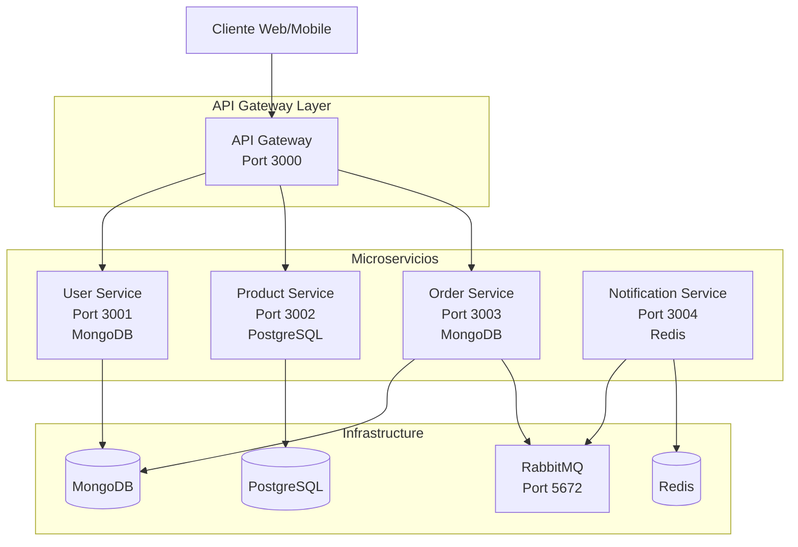

# Sistema E-commerce con Arquitectura de Microservicios

Una implementación completa de un sistema de e-commerce utilizando arquitectura de microservicios, containerización con Docker, y patrones de software en la nube.

## 🏗️ Arquitectura del Sistema



## 🚀 Inicio Rápido

### Prerrequisitos

- Docker y Docker Compose instalados
- Make (opcional, pero recomendado)
- Node.js 18+ (para desarrollo local)
- Python 3.11+ (para desarrollo local)

### Configuración e Instalación

1. **Clonar y configurar el proyecto:**
```bash
git clone <repository-url>
cd arq
```

2. **Configuración automática completa:**
```bash
make setup
```

O usando el script directamente:
```bash
chmod +x scripts/setup.sh
./scripts/setup.sh
```

3. **Verificar el despliegue:**
```bash
make status
```

## 📋 Servicios Incluidos

| Servicio | Puerto | Tecnología | Base de Datos | Descripción |
|----------|--------|------------|---------------|-------------|
| API Gateway | 3000 | Node.js + Express | - | Punto de entrada único, enrutamiento, autenticación |
| User Service | 3001 | Node.js + Express | MongoDB | Gestión de usuarios y autenticación |
| Product Service | 3002 | Python + FastAPI | PostgreSQL | Catálogo de productos y inventario |
| Order Service | 3003 | Node.js + Express | MongoDB | Procesamiento de pedidos |
| Notification Service | 3004 | Python + FastAPI | Redis | Sistema de notificaciones por email |

### Servicios de Infraestructura

| Servicio | Puerto | Credenciales | Propósito |
|----------|--------|--------------|-----------|
| MongoDB | 27017 | admin/password123 | Base de datos para usuarios y pedidos |
| PostgreSQL | 5432 | postgres/password | Base de datos para productos |
| Redis | 6379 | - | Cache y sesiones |
| RabbitMQ | 5672, 15672 | admin/password123 | Cola de mensajes |

## 🛠️ Comandos Disponibles

### Comandos Make

```bash
make help          # Mostrar ayuda completa
make setup          # Configuración inicial completa
make start          # Iniciar todos los servicios
make stop           # Detener todos los servicios
make restart        # Reiniciar servicios
make status         # Ver estado de servicios
make logs           # Ver logs de todos los servicios
make test           # Ejecutar pruebas de integración
make clean          # Limpiar sistema completo
```

### Scripts Manuales

```bash
# Configuración
./scripts/setup.sh

# Monitoreo
./scripts/monitor.sh status
./scripts/monitor.sh test
./scripts/monitor.sh api-test

# Limpieza
./scripts/teardown.sh

# Pruebas
./tests/run-tests.sh
```

## 🧪 Pruebas

### Ejecutar Pruebas de Integración

```bash
# Todas las pruebas
make test

# Con coverage
cd tests && npm run test:coverage

# Solo pruebas específicas
cd tests && npm run test:integration

# En modo watch (desarrollo)
cd tests && npm run test:watch
```

### Pruebas Manuales de API

```bash
# Health check
curl http://localhost:3000/health

# Registro de usuario
curl -X POST http://localhost:3000/api/users/register \
  -H "Content-Type: application/json" \
  -d '{"email":"test@ejemplo.com","password":"password123","firstName":"Test","lastName":"User"}'

# Login
curl -X POST http://localhost:3000/api/users/login \
  -H "Content-Type: application/json" \
  -d '{"email":"test@ejemplo.com","password":"password123"}'

# Listar productos
curl http://localhost:3000/api/products

# Crear pedido (requiere token)
curl -X POST http://localhost:3000/api/orders \
  -H "Content-Type: application/json" \
  -H "Authorization: Bearer <token>" \
  -d '{"items":[{"productId":1,"quantity":2}],"shippingAddress":{"street":"Calle 123","city":"Madrid","state":"Madrid","zipCode":"28001","country":"España"}}'
```

## 📊 Monitoreo y Observabilidad

### URLs de Administración

- **RabbitMQ Management:** http://localhost:15672 (admin/password123)
- **API Gateway:** http://localhost:3000
- **Notification Service:** http://localhost:3004

### Health Checks

```bash
# Gateway health
curl http://localhost:3000/health

# Servicios agregados
curl http://localhost:3000/api/health

# Servicio individual
curl http://localhost:3004/health
```

### Logs y Debugging

```bash
# Logs de todos los servicios
make logs

# Logs de servicio específico
docker-compose logs -f api-gateway

# Estado de contenedores
docker-compose ps

# Estadísticas de recursos
docker stats
```

## 🔧 Desarrollo Local

### Configurar Entorno de Desarrollo

```bash
# Instalar dependencias
make install-deps

# Iniciar solo infraestructura
make start-infra

# Desarrollo individual de servicios
make dev-api-gateway
make dev-user-service
make dev-product-service
make dev-order-service
make dev-notification-service
```

### Variables de Entorno

Copiar y personalizar:
```bash
cp .env.example .env
```

Principales variables:
```env
JWT_SECRET=your-super-secret-jwt-key
SMTP_USERNAME=your-gmail-username
SMTP_PASSWORD=your-app-specific-password
FROM_EMAIL=noreply@your-domain.com
```

## 🏛️ Patrones Implementados

### Patrones de Microservicios

- **API Gateway Pattern**: Punto de entrada único para todos los servicios
- **Database per Service**: Cada microservicio tiene su propia base de datos
- **Event-Driven Architecture**: Comunicación asíncrona vía mensajería
- **Circuit Breaker Pattern**: Tolerancia a fallos entre servicios
- **Health Check Pattern**: Monitoreo de salud de servicios

### Patrones de Mensajería

- **Publish/Subscribe**: Eventos de pedidos y notificaciones
- **Message Queues**: RabbitMQ para comunicación asíncrona
- **Event Sourcing**: Registro de eventos de dominio

### Patrones de Seguridad

- **JWT Authentication**: Tokens de autenticación
- **Rate Limiting**: Limitación de peticiones
- **Input Validation**: Validación de datos de entrada

## 📚 Documentación Adicional

- [**Documentación de APIs**](./API-DOCUMENTATION.md) - Endpoints y ejemplos detallados
- [**Diagramas de Arquitectura**](./architecture-diagrams.md) - Diagramas Mermaid completos

## 🔍 Solución de Problemas

### Problemas Comunes

1. **Servicios no inician:**
```bash
# Verificar logs
make logs
# Reiniciar servicios
make restart
```

2. **Error de conexión a base de datos:**
```bash
# Verificar que la infraestructura esté lista
./scripts/monitor.sh infra
# Reiniciar solo infraestructura
make start-infra
```

3. **Puertos ocupados:**
```bash
# Detener servicios existentes
make stop
# Verificar puertos
netstat -tlnp | grep :3000
```

### Logs de Debugging

```bash
# Logs detallados por servicio
docker-compose logs -f --tail=100 user-service
docker-compose logs -f --tail=100 product-service
docker-compose logs -f --tail=100 order-service
docker-compose logs -f --tail=100 notification-service
```

## 🤝 Contribución

1. Fork del proyecto
2. Crear feature branch (`git checkout -b feature/nueva-funcionalidad`)
3. Commit de cambios (`git commit -am 'Agregar nueva funcionalidad'`)
4. Push al branch (`git push origin feature/nueva-funcionalidad`)
5. Crear Pull Request

## 📄 Licencia

Este proyecto está licenciado bajo la Licencia MIT - ver el archivo [LICENSE](LICENSE) para detalles.

## 🎯 Características Técnicas

### Tecnologías Core
- **Containerización**: Docker y Docker Compose
- **API Gateway**: Node.js + Express con proxy middleware
- **Bases de Datos**: MongoDB, PostgreSQL, Redis
- **Message Broker**: RabbitMQ
- **Lenguajes**: JavaScript (Node.js), Python

### Características de Producción
- Health checks automáticos
- Reinicio automático de contenedores
- Volúmenes persistentes para datos
- Red Docker aislada
- Logging estructurado
- Rate limiting
- Circuit breaker
- Validación de entrada
- Manejo de errores centralizado

### Escalabilidad
- Servicios independientes escalables
- Base de datos por servicio
- Comunicación asíncrona
- Cache distribuido (Redis)
- Load balancing (Nginx opcional)

---

**Desarrollado como práctica educativa de arquitectura de microservicios** 🎓